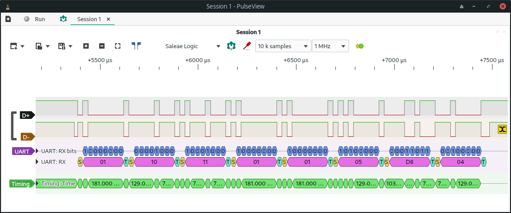

# Energy Recovery Ventilator (ERV) Control via Python

*DISCLAIMER: This script does not replace the VAUTOW or VTTOUCHW control devices. One of them is still required to be connected to the ERV device and can be used along with these scripts.*

## Software

The [vautow.py](vautow.py) and [vttouchw.py](vttouchw.py) Python scripts are written for Linux. Here is a Raspberry Pi example:
```
sudo apt install git python3-serial
git clone --depth=1 https://github.com/bgant/erv
python3 erv/vautow.py /dev/ttyUSB0 auto
python3 erv/vautow.py /dev/ttyUSB0 standby
```

If you are importing either script as a module, you can use the following syntax:
```python
import vautow as VAUTOW
erv = VAUTOW('/dev/ttyUSB0')
erv.auto()
erv.standby()
erv.state
erv.status
```

## Hardware
I installed a [B180E75RT](https://www.sylvane.com/broan-b180e75rt-ai-series-180-cfm-energy-recovery-ventilator.html) ERV with a [VTTOUCHW](https://www.sylvane.com/broan-vautow-automatic-wall-control-ai-series.html) Touchscreen Wall Control. I later purchased a [VAUTOW](https://www.sylvane.com/broan-vautow-automatic-wall-control-ai-series.html) Automatic Wall Control to compare wall control signals.

Only one of these wall control devices should be connected to the ERV via [22/4 security cable](https://www.lowes.com/pd/Southwire-1-ft-22-4-Solid-White-Security-Cable/4284059) to the 12V DC, D+, D-, and GND ports on both devices. The D+ and D- ports indicate that they are using [RS485 serial communication](https://en.wikipedia.org/wiki/RS-485) which allows for multiple daisy-chained devices over long lengths of wire to talk to each other.

I purchased a cheap generic [USB Logic Analyzer](https://www.amazon.com/gp/product/B077LSG5P2) so that I could see what signals were being sent across the RS485 wires. I watched a few [Sigrok/PulseView](https://sigrok.org/wiki/Main_Page) tutorials on YouTube and used their open-source software along with their open-source **fxlafw** firmware on the Logic Analyzer. I tried different UART [baud rates](https://lucidar.me/en/serialib/most-used-baud-rates-table/) on the D+ signal and it looks like it is 38400: 



## Project Goal
Due to heavy smoke from wildfires in 2023, I wanted a way to automatically turn off the ERV (to avoid sucking the smoke into the house) if the EPA Air Quality Index (AQI) was too high. I contacted the ERV vendor and they recommended sending a 12V DC (high) signal to the OVR wire on the ERV. This would "Override" the ERV controls and run it at Maximum speed to clear the smoke out of the house...?!? :thinking:

I realized this would be a fun project to learn how to view digital signals using a cheap Logic Analyzer. Even if I didn't know what the controls were saying to the ERV, I should be able to isolate which RS485 bytes correspond with which button presses, and try sending those same bytes in Python.


## Thanks


