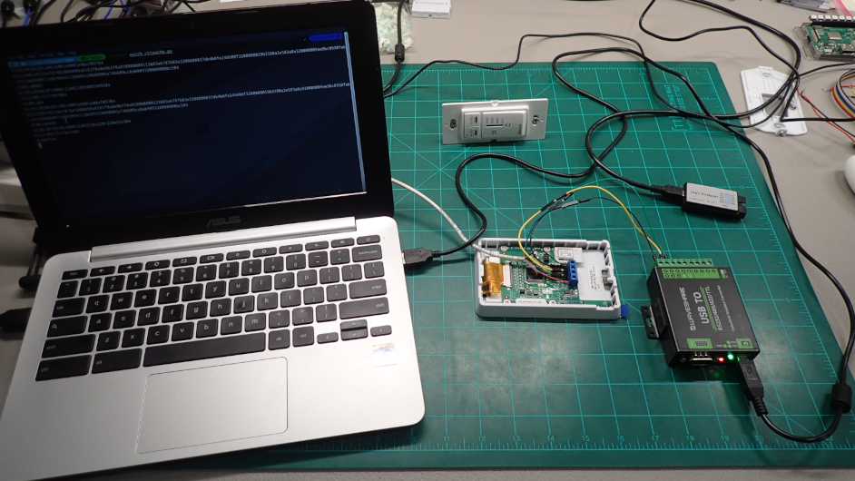

# Energy Recovery Ventilator (ERV) Control via Python

*IMPORTANT: These Python scripts DO NOT replace the wall control device. A wall control device is still required to be connected to the ERV.*

## Software

The [vautow.py](vautow.py) and [vttouchw.py](vttouchw.py) Python scripts are written for Linux. Here is an example on a Raspberry Pi:
```
sudo apt install git python3-serial
git clone --depth=1 https://github.com/bgant/erv
python3 erv/vautow.py   <-- Shows example and list of available commands
python3 erv/vautow.py /dev/ttyUSB0 auto
python3 erv/vautow.py /dev/ttyUSB0 standby
```

If you are importing either script as a Python module, here is a vautow.py example:
```python
from vautow import VAUTOW
erv = VAUTOW('/dev/ttyUSB0')
erv.commands()
erv.auto()
erv.standby()
erv.state
erv.status
```

## Project Goal
Due to heavy smoke from wildfires in 2023, I wanted a way to automatically turn off the ERV (to avoid pulling smoke into the house) if the [EPA Air Quality Index](https://www.airnow.gov/national-maps/) [API](https://docs.airnowapi.org/webservices) value was too high. I contacted the ERV vendor and they recommended sending a 12V DC (high) signal to the OVR wire on the ERV. This would "override" the wall control and run the ERV at Maximum speed to clear the smoke out of the house...?!? :thinking:

I realized this would be a fun project to learn how to view unknown digital signals. Even if I didn't know what the wall control was saying to the ERV, I should be able to isolate which bytes correspond with which button presses, and try sending those same bytes using Python. My end goal is a [MicroPython](https://micropython.org/) device that automatically shuts off the ERV when the outside air is not optimal.

## Hardware
I installed a [B180E75RT](https://www.sylvane.com/broan-b180e75rt-ai-series-180-cfm-energy-recovery-ventilator.html) ERV with a [VTTOUCHW](https://www.sylvane.com/broan-vautow-automatic-wall-control-ai-series.html) Touchscreen Wall Control. I then purchased a [VAUTOW](https://www.sylvane.com/broan-vautow-automatic-wall-control-ai-series.html) Automatic Wall Control to compare wall control signals.

Only one of these wall control devices should be connected to the ERV via [22/4 security cable](https://www.lowes.com/pd/Southwire-1-ft-22-4-Solid-White-Security-Cable/4284059) to the 12V DC, D+, D-, and GND ports on both devices. The D+ and D- labels indicate that the devices are using [RS485 serial communication](https://en.wikipedia.org/wiki/RS-485) which allows for multiple daisy-chained devices over long lengths of wire to talk to each other.

I purchased a cheap generic [USB Logic Analyzer](https://www.amazon.com/gp/product/B077LSG5P2) so that I could see what signals were being sent across the 1.5V DC D+ and D- wires. I watched a few [Sigrok/PulseView](https://sigrok.org/wiki/Main_Page) tutorials and used their open-source software along with their open-source **fxlafw** firmware on the Logic Analyzer. I tried different UART [baud rates](https://lucidar.me/en/serialib/most-used-baud-rates-table/) on the D+ signal and it looks like it is 38400: 


Once I knew what the bytes on the wire should look like, I used a [USB-to-RS485](https://www.amazon.com/gp/product/B0BTYKS8LK) adapter daisy-chained to D+, D-, and GND to look at the data on Linux (here is a [cheaper adpater](https://www.amazon.com/Industrial-USB-RS485-Converter-Communication/dp/B081MB6PN2) that would also work):

```
sudo chmod o+rw /dev/ttyUSB0
stty -F 38400 /dev/ttyUSB0
hexdump /dev/ttyUSB0
```

I wrote the [watch_vautow.py](watch_vautow.py) and [watch_vttouchw.py](watch_vttouchw.py) Python scripts to isolate which data frames are generated for each wall control button push. My research notes for this work are in [notes_vautow.txt](notes_vautow.txt) and [notes_vttouchw.txt](notes_vttouchw.txt).




