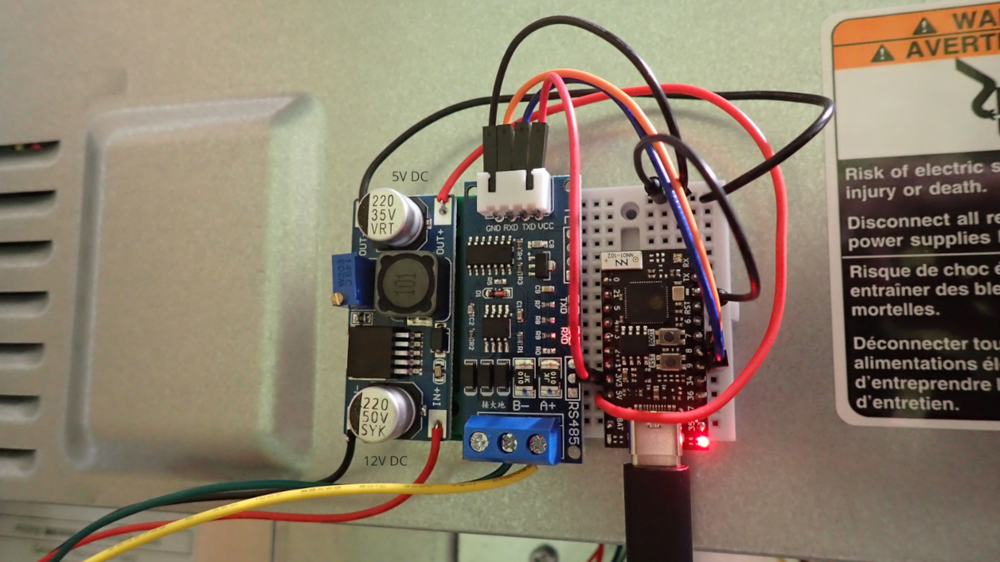

# Energy Recovery Ventilator (ERV) Control via MicroPython

## Hardware
I wired 12V DC from my [B180E75RT](https://www.sylvane.com/broan-b180e75rt-ai-series-180-cfm-energy-recovery-ventilator.html) ERV to a [step down module](https://www.amazon.com/dp/B08NV3JCBC/) to send 5V DC into a [TinyS3](https://esp32s3.com/tinys3.html) microcontroller. I then took 3.3V DC from the TinyS3 to a [RS485 module](https://www.amazon.com/dp/B08ZNF55V9) connected to D+ and D- on the ERV. There are 12V DC, D+, D-, and GND wires also connected from the ERV to a [VTTOUCHW](https://www.sylvane.com/broan-vautow-automatic-wall-control-ai-series.html) Wall Control device.

## Software
The [main.py](main.py) MicroPython script contains the PROJECT function that runs a series of checks: Is it nighttime? Is it too hot or cold outside? Is the [EPA Air Quality Index](https://www.airnow.gov/national-maps/) value too high? Is a local [PMS7003](https://www.amazon.com/dp/B0B1J8FQ7M) Air Quaility Sensor reporting high values (neighbors burning leaves)?

If any of the above are True, then the [vttouchw.py](vttouchw.py) script puts the ERV in Standby mode. If they are all False, then the ERV is put into Smart mode. An internal timer runs the check every 5 minutes. 
